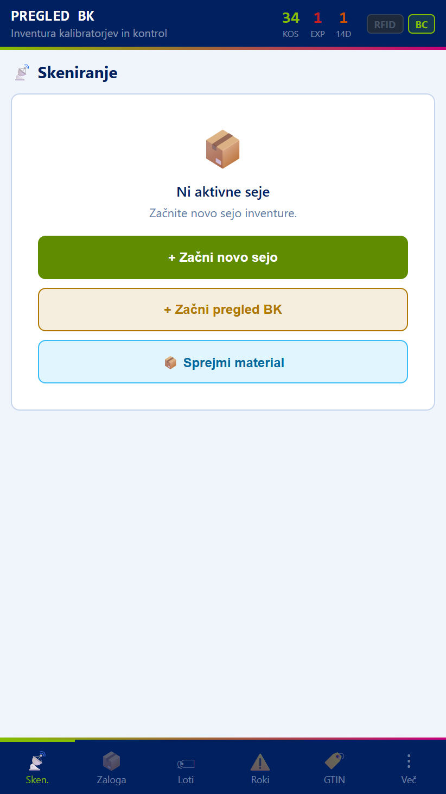
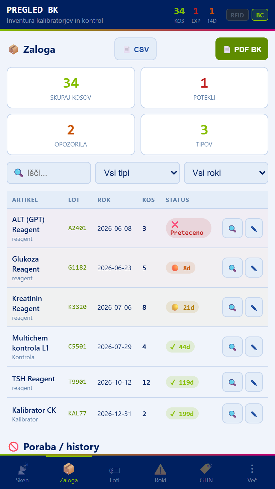
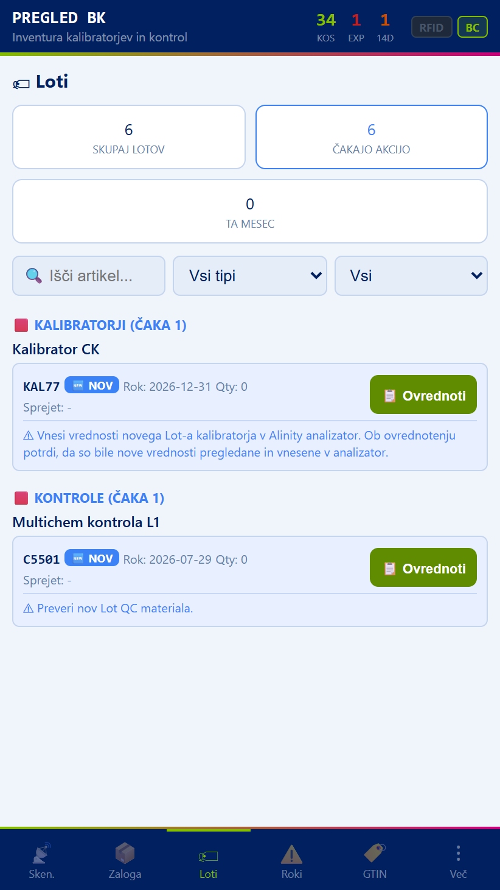
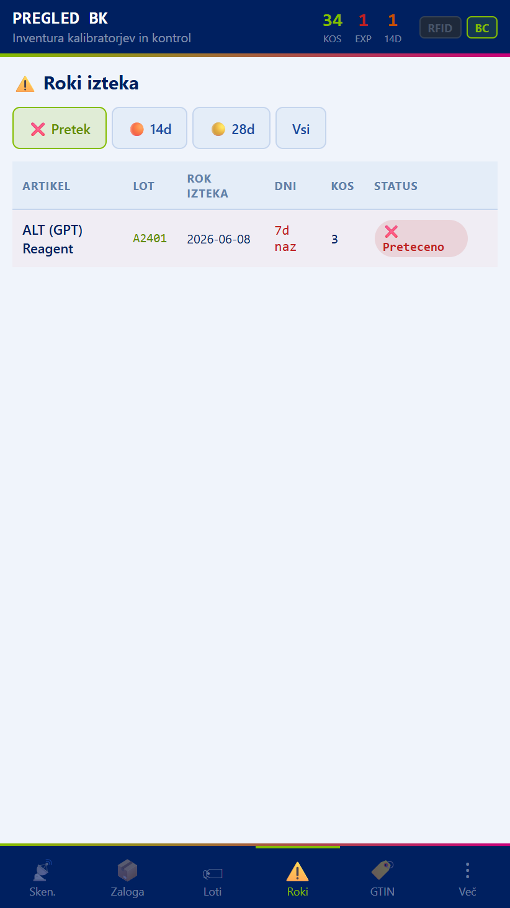
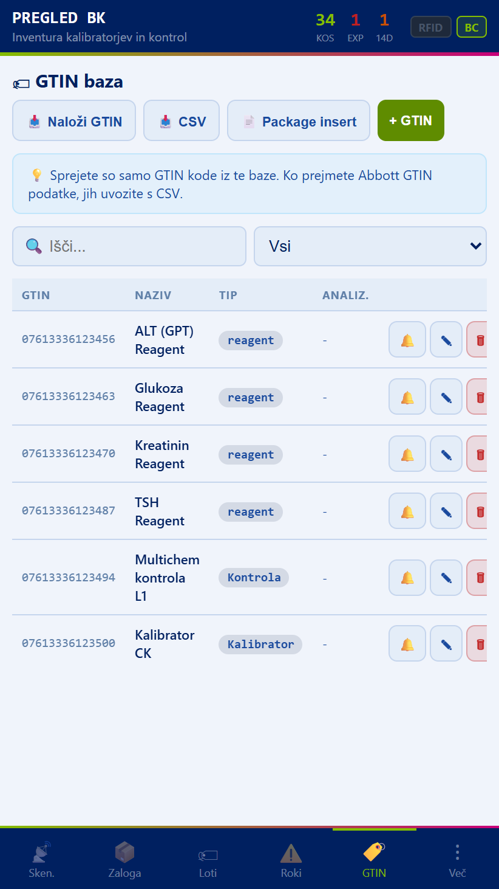
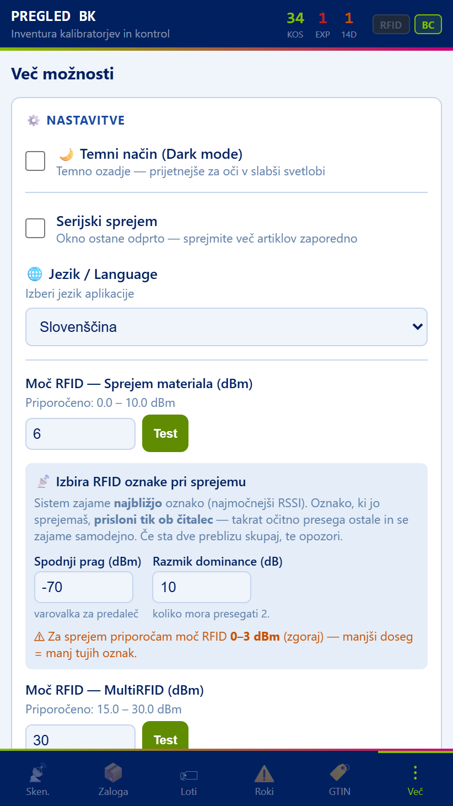

# Navodila za uporabo — Pregled BK

Aplikacija **Pregled BK** na čitalniku Zebra TC20 je namenjena inventuri ter spremljanju zaloge kontrol in kalibratorjev (BK = biokemija). Omogoča RFID/črtno skeniranje, sprejem materiala, pregled rokov uporabe in izvoz poročila v PDF.

Ta navodila se samodejno posodabljajo ob vsaki nadgradnji aplikacije (gradnja prek GitHub Actions). Posnetki zaslonov so zajeti neposredno iz trenutne različice aplikacije.

## Glavni zaslon in navigacija

Na vrhu vsakega zaslona je glava z imenom aplikacije in tremi števci:

- **KOS** — skupno število kosov v zalogi.
- **EXP** (rdeče) — število artiklov s potečenim rokom.
- **14D** — število artiklov, ki potečejo v 14 dneh.

Desno zgoraj sta gumba **RFID** (vklop/izklop RFID branja) in **BC** (črtna koda / barcode).

Na dnu zaslona je glavna navigacija s šestimi zavihki:

- **Sken.** — skeniranje in seje inventure.
- **Zaloga** — pregled trenutne zaloge.
- **Loti** — pregled po lotih (serijah).
- **Roki** — artikli, razvrščeni po roku uporabe.
- **GTIN** — šifrant artiklov (GTIN → ime, tip).
- **Več** — nastavitve, jezik, moč RFID, operaterji, sinhronizacija.

## Skeniranje

Zavihek **Sken.** je izhodišče za vse delo s čitalnikom. Na voljo so tri možnosti:

- **+ Začni novo sejo** — začne novo sejo inventure. Skenirane artikle (RFID/SN) seja zbira, dokler je ne zaključite.
- **+ Začni pregled BK** — začne sejo, namenjeno pregledu zaloge kontrol in kalibratorjev.
- **Sprejmi material** — odpre obrazec za sprejem novega artikla v zalogo (en kos naenkrat).

### Sprejem materiala

Ob kliku **Sprejmi material** se odpre obrazec v korakih:

1. Skenirajte črtno kodo artikla (GTIN, lot, rok) ali jo vnesite ročno.
2. Po potrebi zajemite RFID oznako — sistem zajame **najbližjo** oznako (najmočnejši signal); oznako prislonite tik ob čitalnik.
3. Potrdite z **Sprejmi**. Če RFID/SN ni na voljo, uporabite **Sprejmi brez RFID/SN (ročno)**.

Vsak sprejem poveča količino v zalogi za 1 kos in zabeleži lot ter rok uporabe.

## Zaloga

Zavihek **Zaloga** prikazuje trenutno stanje. Na vrhu so povzetki: skupaj kosov, potekli, opozorila in število tipov.

Pod iskalnikom lahko filtrirate po **tipu** (reagent, kontrola, kalibrator) in po **roku**. Vsaka vrstica prikazuje artikel, lot, rok, količino in barvni status roka.

- Gumb **PDF BK** ustvari PDF poročilo zaloge kontrol in kalibratorjev (shrani se v mapo Prenosi kot `PregledBK_LLLL-MM-DD.pdf`). V PDF je rok uporabe obarvan enako kot v aplikaciji.
- Gumb **CSV** izvozi zalogo v tabelo CSV.
- Ikona lupe odpre podrobnosti artikla (loti, serijske številke, EPC).

## Barvne oznake rokov uporabe

Rok uporabe je v aplikaciji in v PDF poročilu obarvan po istem ključu:

- **Rdeče — Pretečeno**: rok je že potekel.
- **Oranžno (≤ 14 dni)**: artikel poteče v 14 dneh ali manj.
- **Rumeno (≤ 28 dni)**: artikel poteče v 28 dneh ali manj.
- **Zeleno**: rok je daljši od 28 dni.

## Loti

Zavihek **Loti** združi zalogo po lotih (serijah). Za vsak lot vidite artikel, rok uporabe in skupno količino. Uporabno za sledenje, kdaj poteče posamezna serija.

## Roki

Zavihek **Roki** prikaže artikle, razvrščene po roku uporabe — najprej tisti, ki potečejo najprej. Zgornji zavihki omogočajo filtriranje: **14d**, **28d**, **Vsi**. Tako hitro vidite, kaj je treba porabiti ali zavreči.

## GTIN

Zavihek **GTIN** je šifrant artiklov: preslikava črtne kode (GTIN) v ime in tip artikla. Ko skenirate nov GTIN, ki ga ni v šifrantu, ga sistem doda — ime in tip lahko dopolnite tukaj.

## Več

Zavihek **Več** vsebuje nastavitve:

- **Temni način** — temno ozadje za delo v slabši svetlobi.
- **Serijski sprejem** — okno za sprejem ostane odprto, da zaporedno sprejmete več artiklov.
- **Jezik / Language** — izbira jezika aplikacije.
- **Moč RFID — Sprejem materiala (dBm)**: priporočeno 0–3 dBm (manjši doseg = manj tujih oznak). Gumb **Test** preveri trenutno moč.
- **Izbira RFID oznake pri sprejemu** — nastavitev praga in dominance, da se zajame le prava (najbližja) oznaka.
- **Moč RFID — MultiRFID (dBm)**: priporočeno 15–30 dBm za množično branje.
- **Operaterji** — seznam operaterjev (matična številka + ime). Operaterja lahko dodate, uredite (✎) ali odstranite. Ob izdelavi PDF BK se operater podpiše z matično številko.
- **Sinhronizacija** — izmenjava podatkov z aplikacijo BIO Alinity (Quick Share / izvoz–uvoz).

## Pogosta vprašanja

**Kako zaključim sejo inventure?**
V zavihku Sken. med aktivno sejo izberite zaključek seje; podatki se zapišejo v zalogo.

**Zakaj se zajame napačna RFID oznaka?**
Zmanjšajte moč RFID za sprejem (Več → Moč RFID — Sprejem) na 0–3 dBm in oznako prislonite tik ob čitalnik.

**Kje najdem PDF poročilo?**
V mapi Prenosi (Downloads) na čitalniku, ime `PregledBK_LLLL-MM-DD.pdf`.
